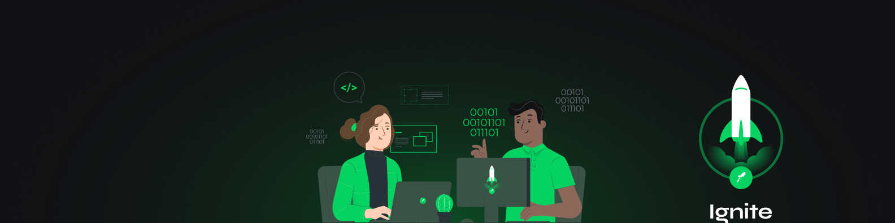

## 🚀 Technologies

- [ReactJS](https://reactjs.org/)
- [Typescript](https://www.typescriptlang.org/)
- [Sass](https://sass-lang.com/)

## 🔥️ Starting the project

First clone the project and access the folder

```bash
$ git clone https://github.com/JonathaGomes/github-explorer && cd github-explorer

# After that follow the steps below.

# Installing project dependencies
$ yarn

# Starting the project
$ yarn start
```

## 💻️ Project

Project developed to learn how to configure a react project from scratch with webpack and babel, using some hooks and configuration of Sass and Typescript

<hr>

<p align="center">
Made with 💜️ by Jonatha Gomes 👋️ <a href="https://www.linkedin.com/in/jonatha-gomes/">Get in touch!</a>
</p>
